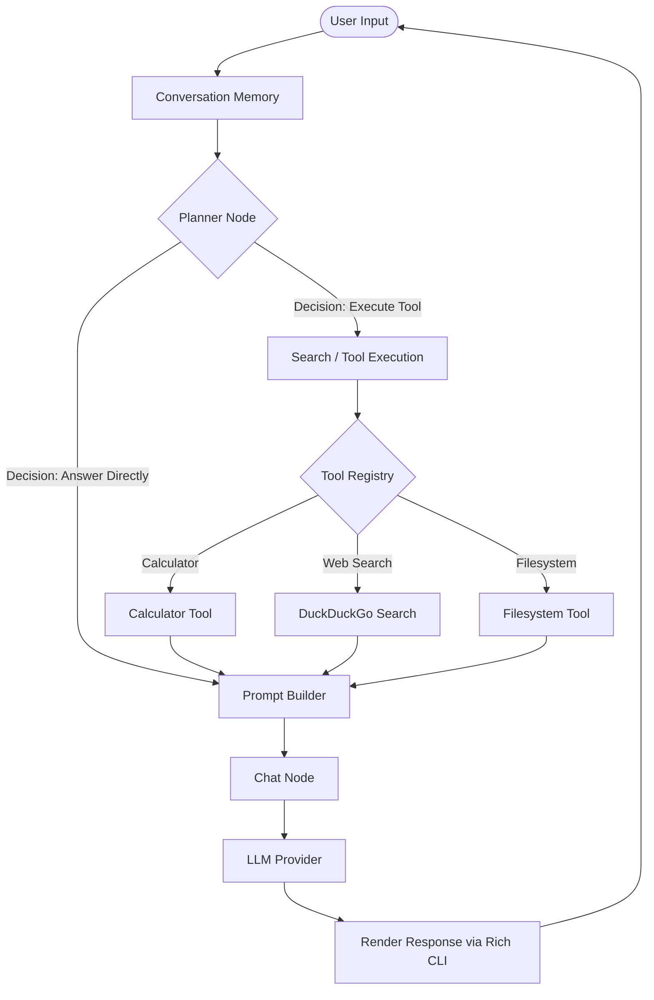

# Hasini: Advanced Multi-Provider AI Agent Framework

[](https://www.python.org/)
[](https://github.com/langchain-ai/langgraph)
[](https://github.com/langchain-ai/langchain)
[](https://github.com/pydantic/pydantic)
[](https://github.com/Textualize/rich)

**Hasini** (named after the agent config) is a production-grade, stateful AI agent framework built using **LangGraph** and **LangChain**. It features a robust, state-based decision loop that dynamically routes queries between immediate knowledge response and tool execution.

Equipped with a rich CLI dashboard and interactive slash commands, the agent supports dynamic, runtime hot-swapping of LLM providers (including **OpenRouter**, **Google Gemini**, **Z.ai**, and local **Ollama** models) and executes specialized tools like a SymPy-based calculator, DuckDuckGo search, and a secure local file system controller.

---

## 🏗️ Architecture Workflow

Hasini uses a structured LangGraph state machine. Each turn processes user inputs through a planner that decides whether external tools are needed.



---

## ✨ Key Features

*   **Stateful Workflow Engine:** Driven by **LangGraph** to handle multi-step reasoning, conditional routing, and state persistence natively.
*   **Multi-Provider LLM Integration:** Out-of-the-box support for:
    *   **OpenRouter** (e.g., NVIDIA Nemotron models)
    *   **Google AI Studio** (e.g., Gemini 2.5 Flash/Pro)
    *   **Z.ai** (e.g., GLM-4)
    *   **Ollama** (Local models like Phi-4, Qwen)
*   **Dynamic Command-Line Interface:**
    *   Interactive shell using `rich` with live statuses and clean terminal layouts.
    *   Slash commands to update settings on the fly without restarting the agent.
*   **Extensible Tool Plugin System:**
    *   🔍 **DuckDuckGo Search:** Retrieves real-time web information.
    *   🧮 **Calculator Tool:** Evaluates math expressions securely with SymPy.
    *   📁 **FileSystem Tool:** Performs sandboxed file/directory operations (defaulting to the `D:` drive for safety).

---

## 📂 Repository Structure

```text
d:\My_Ai_Agent/
│
├── main.py                 # Entry point - starts the interactive chat loop
├── requirements.txt        # Python dependency manifest
├── README.md              # Project documentation and guide
├── .env                   # Configuration & API keys (local-only, ignored by Git)
├── .gitignore             # Git ignore rules for virtual environments, keys, cache, and documentation
│
└── app/                   # Main application package
    ├── builders/          # Context and prompt template builders
    ├── chains/            # LangChain initialization structures
    ├── commands/          # Interactive CLI command definitions (/settings, /provider)
    ├── configurations/    # Settings, default models, and provider credentials
    ├── nodes/             # LangGraph execution steps (planner, search, chat)
    ├── prompts/           # Core AI prompt templates
    ├── tools/             # Plugin tool definitions (FileSystem, WebSearch, Calculator)
    ├── UI/                # Terminal output styling, status indicators, and banners
    └── ...                # Core router, state, schema, and error definitions
```

---

## 🚀 Setup & Installation

### 1. Prerequisites
Ensure you have **Python 3.10** or higher installed.

### 2. Clone and Navigate
Clone the repository to your local machine:
```bash
git clone https://github.com/n-r-kondapalli-21/AI_Agent.git
cd My_Ai_Agent
```

### 3. Create Virtual Environment
Create and activate a virtual environment:
```bash
# Windows
python -m venv venv
venv\Scripts\activate

# macOS / Linux
python3 -m venv venv
source venv/bin/activate
```

### 4. Install Dependencies
Install all package requirements:
```bash
pip install -r requirements.txt
```

### 5. Configure Environment Variables
Create a file named `.env` in the root directory:
```env
# API Keys (Provide at least one key for your chosen provider)
OPENROUTER_API_KEY=your_openrouter_key
GOOGLE_API_KEY=your_google_api_key
ZAI_API_KEY=your_zai_api_key

# Runtime Settings (Optional overrides)
TEMPERATURE=0
MAX_TOKENS=2000
DEFAULT_PROVIDER=google
DEFAULT_MODEL=gemini-2.5-flash-lite
```

---

## 🎮 How to Run

Launch the interactive CLI by running the main entry script:
```bash
python main.py
```

Upon launching, the CLI will initialize and prompt you for inputs.

### Interactive Slash Commands
While in the interactive session, you can execute special slash commands:

*   `/provider` - Prompt to switch the active LLM provider (e.g., switch from Google to OpenRouter).
*   `/model` - Switch the specific model for the current provider.
*   `/config` - Show the active settings, model selections, and provider keys status.
*   `/settings` - Open an interactive menu containing all customization options.
*   `/help` - View a list of all available commands.
*   `exit` or `quit` - Safely exit the chat session.

---

## ⚙️ Supported Providers & Models

Defaults are configured in [constants.py](file:///d:/My_Ai_Agent/app/configurations/constants.py):

| Provider | Default Planner Model | Default Chat Model |
| :--- | :--- | :--- |
| **OpenRouter** | `nvidia/nemotron-3-super-120b-a12b:free` | `nvidia/nemotron-3-ultra-550b-a55b:free` |
| **Google AI Studio** | `gemini-2.5-flash-lite` | `gemini-2.5-pro` |
| **Z.ai** | `glm-4.5-flash` | `glm-4.7-flash` |
| **Ollama** | `phi4-mini` | `qwen3:4b` |

---

## 🔒 Security & Sandbox Rules

*   **FileSystem Tool Constraint:** File operations are restricted to `D:` drive by default (defined in `constants.py`). Accessing directories outside of the configured root throws a permission violation.
*   **Git Hygiene:** The `.env` file and documentation files (`DOCUMENTATION.md`, `DOCUMENTATION.docx`) are explicitly ignored in [.gitignore](file:///d:/My_Ai_Agent/.gitignore) to prevent accidental leak of API keys and keep the repository clean.

---

## 🤝 Contributing

Contributions are welcome! Please follow these guidelines:
1. Fork the repository.
2. Create a clean feature branch (`git checkout -b feature/AmazingFeature`).
3. Make sure to adhere to existing styles and ensure all Pydantic validators pass.
4. Commit your changes and open a Pull Request.

---

## 📄 License
This project is open-source. Please check the LICENSE file (if available) or customize it according to your needs.